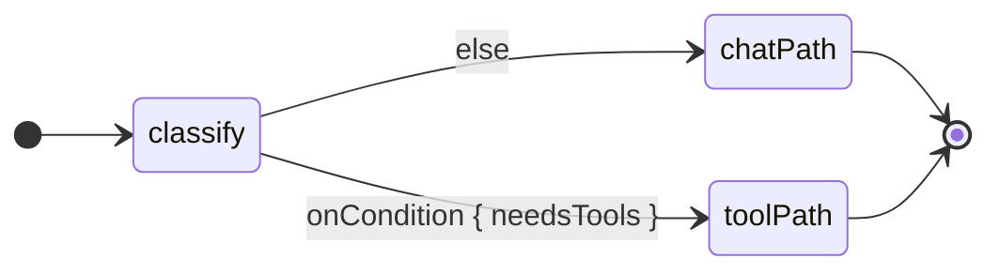
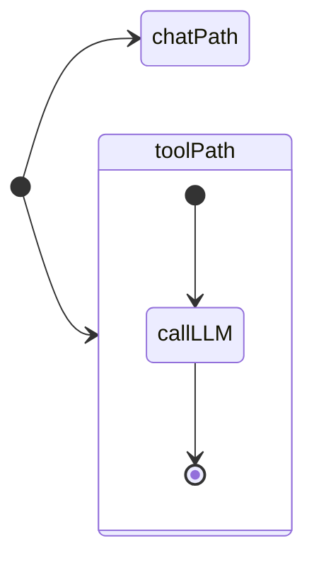

# Koog `strategy { }` 그래프 DSL 치트시트

> **대상**: `docs/koog-strategy-graph.md` — Koog 0.8.0 기준.
> 이 문서의 모든 Kotlin 스니펫은 `ChatStrategy.kt` 또는 `AssistantAgentFactory.kt`의 실제 코드를 그대로 인용하거나,
> 다음 단계 확장을 위한 **"다음 단계 예고" 스케치**임을 명시한 경우에만 작성한다.
> 코드 외 설명은 한국어, 코드 식별자는 영어.

---

## 1. `AIAgent` 생성자와 strategy 오버로드

Koog 0.8.0의 `AIAgent`는 companion object의 `operator fun invoke`를 통해 인스턴스를 만든다.
그래프 전략을 사용하는 경우 공개 오버로드는 두 종류다.

**Overload A — `AIAgentConfig` 경유** (권장):

```kotlin
AIAgent(
    promptExecutor: PromptExecutor,
    agentConfig: AIAgentConfig,                       // withSystemPrompt(...) 팩토리로 생성
    strategy: AIAgentGraphStrategy<I, O>,
    toolRegistry: ToolRegistry,
    agentId: String = "...",                          // 기본값 있음
    clock: Clock = ...,                               // 기본값 있음
) { /* GraphAIAgent.FeatureContext -> Unit */ }
```

`AIAgentConfig.withSystemPrompt(systemPrompt, model, agentId, maxIterations)`로 설정값을 한 번에 묶는다.
시스템 프롬프트를 strategy 내부 노드에서 설정하는 경우 `systemPrompt = ""`를 넘기면 된다.

**Overload B — `LLModel + ResponseProcessor` 직접 지정** (제네릭 `<I,O>`):

```kotlin
AIAgent(
    promptExecutor: PromptExecutor,
    llmModel: LLModel,
    strategy: AIAgentGraphStrategy<I, O>,
    responseProcessor: ResponseProcessor,             // 기본값 없음 — 구체 구현 필요
    toolRegistry: ToolRegistry,
    systemPrompt: String = "",
    ...
) { /* FeatureContext -> Unit */ }
```

`ResponseProcessor`는 추상 클래스로 companion 단위 no-op이 없다.
**본 프로젝트에서는 Overload A를 사용한다.**

`AssistantAgentFactory.kt:37–58`의 `create()` 메서드가 이 오버로드를 호출하는 방식:

```kotlin
// AssistantAgentFactory.kt:37–58
@OptIn(ExperimentalAgentsApi::class)
fun create(): AIAgent<String, String> =
    AIAgent(
        promptExecutor = promptExecutor,
        agentConfig = AIAgentConfig.withSystemPrompt(
            systemPrompt = SYSTEM_PROMPT,
            model = llmModel,
        ),
        strategy = chatStrategy(),
        toolRegistry = ToolRegistry { },
    ) {
        install(OpenTelemetry) {
            setVerbose(tracingVerbose)
            addLangfuseExporter()
        }
        install(ChatMemory) {
            chatHistoryProvider = historyProvider
            windowSize(windowSize)
        }
        install(LongTermMemory) {
            retrieval {
                storage = vectorStorage
                searchStrategy = SimilaritySearchStrategy(topK = topK)
            }
        }
    }
```

---

## 2. `strategy<I, O>` 블록과 자동 `nodeStart` / `nodeFinish`

```kotlin
fun <Input, Output> strategy(
    name: String,
    toolSelectionStrategy: ToolSelectionStrategy = ToolSelectionStrategy.NONE,
    block: AIAgentGraphStrategyBuilder<Input, Output>.() -> Unit,
): AIAgentGraphStrategy<Input, Output>
```

- FQCN: `ai.koog.agents.core.dsl.builder.AIAgentGraphStrategyBuilderKt.strategy`
- 반환 타입: `ai.koog.agents.core.agent.entity.AIAgentGraphStrategy<Input, Output>`
- `block`의 리시버는 `AIAgentGraphStrategyBuilder<Input, Output>` — 이 리시버에서 노드 선언(`node`, `nodeLLMRequest`, …)과 엣지 연결(`edge(...)`)을 호출한다.

`nodeStart`와 `nodeFinish`는 **선언하는 것이 아니라** 이 빌더의 프로퍼티로 이미 존재한다.

- `nodeStart: StartNode<TInput>` — 그래프의 진입점. 외부에서 `agent.run(input, sessionId)`로 넘긴 값이 여기서 흘러 들어온다.
- `nodeFinish: FinishNode<TOutput>` — 그래프의 종료점. 여기에 도달한 값이 `agent.run()`의 반환값이 된다.
- 두 프로퍼티는 `AIAgentSubgraphBuilderBase`에 추상으로 선언되어 `AIAgentGraphStrategyBuilder`가 구체화한다.

`ChatStrategy.kt:28–38`의 전체 선언:

```kotlin
// ChatStrategy.kt:28–38
internal fun chatStrategy(): AIAgentGraphStrategy<String, String> =
    strategy<String, String>("secretary-chat") {
        val preprocess by node<String, String>("preprocess") { input -> input.trim() }
        val callLLM by nodeLLMRequest("callLLM")
        val emitText by node<Message.Response, String>("emitText") { response -> response.content }

        edge(nodeStart forwardTo preprocess)
        edge(preprocess forwardTo callLLM)
        edge(callLLM forwardTo emitText)
        edge(emitText forwardTo nodeFinish)
    }
```

---

## 3. `node<I, O>` 프로퍼티 위임

```kotlin
fun <Input, Output> node(
    name: String,
    execute: suspend AIAgentGraphContextBase.(Input) -> Output,
): AIAgentNodeDelegate<Input, Output>
```

- FQCN: `ai.koog.agents.core.dsl.builder.AIAgentSubgraphBuilderKt.node`
- 반환 타입: `AIAgentNodeDelegate<Input, Output>` — `getValue(thisRef, property)`를 구현하므로 `by` 위임으로 사용 가능.
- `by` 위임이 호출될 때 `getValue`는 `AIAgentNodeBase<Input, Output>`을 반환하며, `edge(a forwardTo b)` 등 엣지 빌더가 이 값을 받는다.

`ChatStrategy.kt`의 `preprocess`와 `emitText` 선언:

```kotlin
// ChatStrategy.kt:30
val preprocess by node<String, String>("preprocess") { input -> input.trim() }

// ChatStrategy.kt:32
val emitText by node<Message.Response, String>("emitText") { response -> response.content }
```

`execute` 람다의 리시버 `AIAgentGraphContextBase`는 `llm` 프로퍼티(타입 `AIAgentLLMContext`)를 노출한다.
LLM 세션에 메시지를 추가하려면:

```kotlin
llm.writeSession {
    appendPrompt { system(systemPrompt); user(input) }
}
```

`llm.writeSession` 블록 안의 `appendPrompt { ... }`는 `PromptBuilderAction` SAM 람다다.
`PromptBuilder.system(text)` / `PromptBuilder.user(text)`가 각각 시스템·사용자 메시지를 추가한다.

---

## 4. `forwardTo` 와 (다음 단계용) `onCondition` · `transformed`

### forwardTo (현재 단계 — 사용 중)

```kotlin
infix fun <IO, OI> AIAgentNodeBase<*, IO>.forwardTo(
    target: AIAgentNodeBase<in OI, *>
): AIAgentEdgeBuilderIntermediate<IO, IO, OI>
```

- FQCN: `ai.koog.agents.core.dsl.builder.AIAgentNodeDelegateKt.forwardTo`
- 반환값을 `edge(...)` 빌더에 넘겨야 엣지가 등록된다.
- `ChatStrategy.kt`의 `edge(nodeStart forwardTo preprocess)` 형태가 표준 관용구다.

### onCondition · transformed (다음 단계 예고)

> 아래는 미래 분기 그래프를 위한 스케치다. 현재 코드베이스에는 존재하지 않는다.



```kotlin
// 다음 단계 예고 — 실제 호출 아님
edge(
    (classify forwardTo toolPath).onCondition { output -> output.needsTools }
)
edge(
    (classify forwardTo chatPath).transformed { output -> output.text }
)
```

- `onCondition { predicate }`: 조건이 `true`일 때만 이 엣지를 통과.
- `transformed { transform }`: 엣지를 통과하면서 값을 변환.

---

## 5. 내장 노드 (`nodeLLMRequest`, `nodeDoNothing`)

### nodeLLMRequest

```kotlin
fun nodeLLMRequest(
    name: String,
    sendLastMessageOnly: Boolean = false,
): AIAgentNodeDelegate<String, Message.Response>
```

- FQCN: `ai.koog.agents.core.dsl.extension.AIAgentNodesKt.nodeLLMRequest`
- 동작: 입력 `String`을 user 메시지로 프롬프트에 누적한 뒤 LLM을 호출하고, `Message.Response`(봉인 클래스, 주로 `Message.Assistant`)를 반환한다.
- `ChatStrategy.kt:31`에서 사용: `val callLLM by nodeLLMRequest("callLLM")`

### nodeDoNothing

```kotlin
fun <T> nodeDoNothing(name: String = "doNothing"): AIAgentNodeDelegate<T, T>
```

- FQCN: `ai.koog.agents.core.dsl.extension.AIAgentNodesKt.nodeDoNothing`
- 입력을 그대로 통과시키는 no-op 노드. 테스트 플레이스홀더나 조건부 경로의 빈 분기에 사용한다.

---

## 6. `subgraph` 와 `ToolSelectionStrategy` (다음 단계 예고)

> 이 절은 미래 도구·분기 그래프를 위한 예고다. 현재 코드베이스에는 서브그래프가 없다.

```kotlin
// 시그니처 (다음 단계 예고 — 실제 호출 아님)
fun <I, O> subgraph(
    name: String,
    toolSelectionStrategy: ToolSelectionStrategy = ToolSelectionStrategy.NONE,
    block: AIAgentSubgraphBuilder<I, O>.() -> Unit,
): AIAgentSubgraphDelegate<I, O>
```

`ToolSelectionStrategy`의 선택지:

| 값 | 동작 |
|----|------|
| `ToolSelectionStrategy.NONE` | 이 서브그래프 안에서 도구 비활성화 |
| `ToolSelectionStrategy.ALL` | `ToolRegistry`에 등록된 모든 도구 노출 |
| `ToolSelectionStrategy.Tools(vararg tools)` | 지정한 도구만 이 서브그래프에 노출 |

도구를 특정 서브그래프에서만 노출하는 패턴:



```kotlin
// 다음 단계 예고 — 실제 호출 아님
val toolPath by subgraph<String, String>(
    "tool-path",
    toolSelectionStrategy = ToolSelectionStrategy.Tools(schedulingTools),
) {
    val callLLM by nodeLLMRequest("callLLM")
    edge(nodeStart forwardTo callLLM)
    edge(callLLM forwardTo nodeFinish)
}
```

---

## 7. 기능 설치 (`OpenTelemetry`, `ChatMemory`, `LongTermMemory`)

`AIAgent(...)` 후행 람다(`GraphAIAgent.FeatureContext.() -> Unit`)에서 `install`로 기능을 등록한다.
아래는 `AssistantAgentFactory.kt:44–57`의 실제 install 블록이다.

```kotlin
// AssistantAgentFactory.kt:44–57
install(OpenTelemetry) {
    setVerbose(tracingVerbose)
    addLangfuseExporter()
}
install(ChatMemory) {
    chatHistoryProvider = historyProvider
    windowSize(windowSize)
}
install(LongTermMemory) {
    retrieval {
        storage = vectorStorage
        searchStrategy = SimilaritySearchStrategy(topK = topK)
    }
}
```

각 기능의 역할:

- **`OpenTelemetry`**: 노드 단위 span을 Langfuse로 내보내 Agent Graph 뷰를 그린다.
  `setVerbose(true)`를 켜면 prompt/completion 본문이 span attribute에 포함되지만
  대형 컨텍스트에서 메모리·네트워크 비용이 크다(`secretary.tracing.verbose` 프로퍼티로 조절).
- **`ChatMemory`**: 슬라이딩 윈도우 방식으로 대화 기록을 유지·주입한다.
  `historyProvider`가 채팅방별 세션을 격리하고, `windowSize`가 최대 보관 메시지 수를 제한한다.
- **`LongTermMemory`**: 벡터 유사도 검색으로 관련 과거 기록을 프롬프트에 주입한다.
  `storage`(KoogVectorStore)와 `topK` 검색 전략을 지정한다.

> **경고 — Langfuse 스팬 중복**: Koog의 `OpenTelemetry` feature가 이미 노드 단위 span을
> 만들어 Langfuse Agent Graph 뷰가 의존하는 트리 구조를 형성한다. `AIAgent.run(...)` 호출을
> 또 다른 outer OpenTelemetry span으로 감싸면 같은 노드 span이 이중 카운트된다.
> install 블록을 수정하지 않고 Koog의 span을 그대로 신뢰해야 한다.
> 참고: <https://docs.koog.ai/opentelemetry-langfuse-exporter/>, <https://docs.koog.ai/opentelemetry-support/>

---

## 8. 시스템 프롬프트 배치 결정

본 프로젝트는 `AIAgentConfig.withSystemPrompt(...)`로 시스템 프롬프트를 **한 번만** 주입한다.
이 방식을 선택한 이유:

`ChatMemory`는 대화 기록을 슬라이딩 윈도우로 관리하면서 시스템 메시지도 포함해 추적한다.
만약 `setupPrompt` 노드 안에서 매 턴마다 `llm.writeSession { appendPrompt { system(...) } }`를
호출하면 `ChatMemory`가 시스템 메시지를 **매 턴 누적**한다. 10턴이 지나면 프롬프트에 시스템
메시지가 10개 쌓여 토큰이 불필요하게 부풀어 오르고, 윈도우 경계에서 대화 기록이 잘릴 때
시스템 메시지도 함께 잘릴 위험이 생긴다.

`AIAgentConfig.withSystemPrompt(systemPrompt, model)`는 에이전트 초기화 단계에서 한 번만
프롬프트 헤드에 시스템 메시지를 놓기 때문에 `ChatMemory`의 슬라이딩 윈도우 추적 대상이 되지 않는다.
(Task 1 검증 결과 확인.)

`ChatStrategy.kt`의 `preprocess` 노드는 이 이유로 시스템 프롬프트를 건드리지 않는다.

```kotlin
// ChatStrategy.kt:30 — preprocess는 trim만 수행
val preprocess by node<String, String>("preprocess") { input -> input.trim() }
```

---

## Limitations (실용 메모)

- **`AIAgentGraphStrategy.metadata`는 `agent.run()` 실행 전까지 `null`.**
  `metadata`는 에이전트 준비 단계에서 지연 설정된다. 따라서 `chatStrategy()` 반환값으로
  `strategy.metadata?.nodesMap?.keys`를 즉시 읽어 노드 토폴로지를 introspect할 수 없다.
  `ChatStrategyTest`에서 `chatStrategyHasLinearShape` 테스트를 **작성하지 않은 이유**다 —
  공개 즉시 introspection API가 없어 구성 시점 검증이 불가능하다.

- **`nodeAppendPrompt`는 노드 입력값을 받지 못한다.**
  시그니처: `fun <T> nodeAppendPrompt(name: String, block: PromptBuilder.() -> Unit): AIAgentNodeDelegate<T, T>`.
  `block` 람다에서 노드의 `input` 값에 접근할 수 없어 사용자 메시지를 동적으로 주입하기 어렵다.
  사용자 입력을 user 메시지로 누적하려면 `node { }` 본문에서
  `llm.writeSession { appendPrompt { user(input) } }`를 직접 호출해야 한다.

---

## 함정 (Pitfalls)

### `maxAgentIterations` 기본값 3

`AIAgentConfig.withSystemPrompt(prompt, llm)`의 `maxAgentIterations` 기본값은 **3**으로 매우 보수적이다.
선형 그래프 `nodeStart → preprocess → callLLM → emitText → nodeFinish`도 노드 5개라
기본값 그대로 두면 즉시 `AIAgentMaxNumberOfIterationsReachedException`이 던져진다.

```kotlin
AIAgentConfig.withSystemPrompt(
    prompt = SYSTEM_PROMPT,
    llm = llmModel,
    maxAgentIterations = 50,  // 분기·도구 서브그래프 추가까지 여유
)
```

`AssistantAgentFactory.kt`의 `MAX_AGENT_ITERATIONS` 상수가 이 값을 캡슐화한다. 새 노드를 추가할 때마다
한도가 모자라지 않은지 점검할 것.

### 사이클·재귀 한계

LangGraph의 `GRAPH_RECURSION_LIMIT`(기본 25)처럼 Koog도 사이클 깊이 가드가 필요하다.
사이클 엣지를 만들 때는 state에 step counter를 두고 `onCondition { state.steps < MAX_STEPS }`
형태로 종료 조건을 명시해야 한다. 가드 없는 사이클은 무한 루프 또는 OOM으로 이어진다.
참고: <https://docs.langchain.com/oss/python/langgraph/errors/GRAPH_RECURSION_LIMIT>

### 사이클 토큰 폭주

LLM이 같은 도구를 반복 호출하는 ReAct 루프에서 `ChatMemory`가 대화 기록을 누적하면 토큰이
기하급수적으로 늘어난다. 사이클 노드에는 명시적 token budget·반복 횟수 상한·종료 휴리스틱을
함께 설계해야 한다.

### `@Serializable` 체크포인트

Koog의 persistence/snapshot 기능은 노드 입출력 타입을 `kotlinx-serialization`으로 직렬화한다.
현재 `ChatStrategy`는 전 구간 `String`이라 별도 어노테이션 없이 안전하다.
미래에 intent·context 같은 풍부한 state class를 노드 I/O로 도입하면 해당 클래스에
`@Serializable`을 붙이지 않으면 런타임 오류가 발생한다.
참고: <https://deepwiki.com/JetBrains/koog/6.6-persistence-and-snapshots>

### Langfuse 스팬 중복

`AIAgent.run`을 outer OpenTelemetry span으로 감싸면 Koog가 내부에서 만드는 노드 단위 span이
이중 카운트된다. Langfuse Agent Graph 뷰에서 노드가 두 배로 집계되거나 트리가 깨진다.
Koog의 `OpenTelemetry` feature가 내보내는 span을 그대로 신뢰하고, 별도 outer span을 추가하지 말 것.
참고: <https://docs.koog.ai/opentelemetry-langfuse-exporter/>, <https://docs.koog.ai/opentelemetry-support/>
