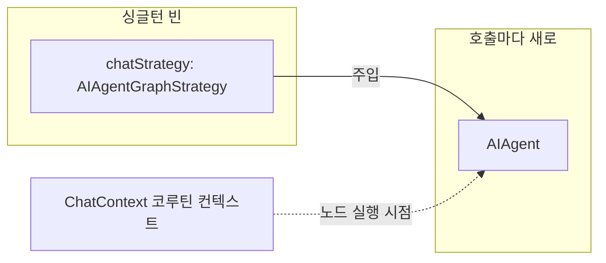
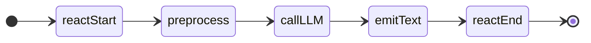
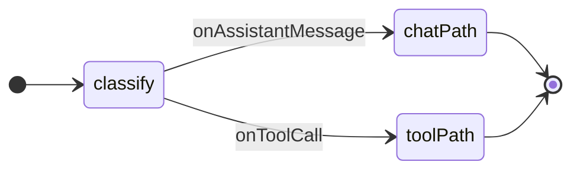

# Koog `strategy { }` 그래프 DSL 치트시트

> **대상**: `docs/koog-strategy-graph.md` — Koog 0.8.0 기준.
> 이 문서의 모든 Kotlin 스니펫은 `ChatStrategyConfig.kt` 또는 `AssistantAgentFactory.kt`의 실제 코드를 그대로 인용하거나,
> 다음 단계 확장을 위한 **"다음 단계 예고" 스케치**임을 명시한 경우에만 작성한다.
> 코드 외 설명은 한국어, 코드 식별자는 영어.

---

## 0. 전략은 스프링 싱글턴 빈

`AIAgentGraphStrategy`는 **실행 상태가 없는 그래프 청사진**이다 — 노드 토폴로지와 엣지만 들고 있고,
런타임 상태(span tree, LLM 세션, 컨텍스트)는 `AIAgent` 인스턴스 쪽에 붙는다. 따라서 전략은 모든 호출이
안전하게 공유할 수 있어 **싱글턴 빈으로 한 번만 빌드**한다.

- `ChatStrategyConfig`(`@Configuration`)의 `@Bean fun chatStrategy(...)`가 전략을 제공한다.
- `AssistantAgentFactory`는 이 빈을 주입받아 **호출마다 새 `AIAgent`**만 만든다 — `AIAgent`를 새로 만드는
  이유는 Koog `OpenTelemetry` feature의 span tree가 인스턴스 단위라 공유 시 race가 나기 때문(§7 참고).
- 호출별 데이터(chatId·messageId)는 전략 빌드 시점이 아니라 **노드 실행 시점**에 `ChatContext` 코루틴
  컨텍스트로 흘러든다(§8 참고).



---

## 1. `AIAgent` 생성자와 strategy 오버로드

Koog 0.8.0의 `AIAgent`는 companion object의 `operator fun invoke`를 통해 인스턴스를 만든다.
그래프 전략을 사용하는 경우 공개 오버로드는 두 종류다.

**Overload A — `AIAgentConfig` 경유** (본 프로젝트가 사용):

```kotlin
AIAgent(
    promptExecutor: PromptExecutor,
    agentConfig: AIAgentConfig,                       // withSystemPrompt(...) 팩토리로 생성
    strategy: AIAgentGraphStrategy<I, O>,
    toolRegistry: ToolRegistry,
    agentId: String = "...",                          // 기본값 있음
    clock: Clock = ...,                               // 기본값 있음
) { /* GraphAIAgent.FeatureContext -> Unit */ }
```

`AIAgentConfig.withSystemPrompt(prompt, llm, agentId, maxAgentIterations)`로 설정값을 한 번에 묶는다.

**Overload B — `LLModel + ResponseProcessor` 직접 지정**: `ResponseProcessor`가 추상 클래스라 구체 구현이
필요하다. **본 프로젝트에서는 Overload A를 사용한다.**

`AssistantAgentFactory.kt:62–92`의 `create()` 메서드 — strategy 빈을 주입받아 그대로 넘기고, agent 인스턴스만 새로 만든다:

```kotlin
// AssistantAgentFactory.kt:62–92
@OptIn(ExperimentalAgentsApi::class)
fun create(): AIAgent<String, String> =
    AIAgent(
        promptExecutor = promptExecutor,
        agentConfig =
            AIAgentConfig.withSystemPrompt(
                prompt = SYSTEM_PROMPT,
                llm = llmModel,
                maxAgentIterations = MAX_AGENT_ITERATIONS,
            ),
        strategy = chatStrategy,                      // 생성자 주입된 싱글턴 빈
        toolRegistry = ToolRegistry { },
    ) {
        install(OpenTelemetry) { ... }
        install(ChatMemory) { ... }
        install(LongTermMemory) { ... }
        install(EventHandler) {
            onAgentExecutionFailed { clearProcessingReaction() }
        }
    }
```

`create()`는 무인자다 — 과거에는 `chatStrategy(onProcessingStart = ...)`처럼 호출별 콜백을 받아 전략을
매번 새로 만들었으나, 전략을 싱글턴 빈으로 분리하면서 호출별 데이터는 `ChatContext`로 옮겼다.

---

## 2. `strategy<I, O>` 블록과 자동 `nodeStart` / `nodeFinish`

```kotlin
fun <Input, Output> strategy(
    name: String,
    toolSelectionStrategy: ToolSelectionStrategy = ToolSelectionStrategy.NONE,
    block: AIAgentGraphStrategyBuilder<Input, Output>.() -> Unit,
): AIAgentGraphStrategy<Input, Output>
```

- FQCN: `ai.koog.agents.core.dsl.builder.AIAgentGraphStrategyBuilderKt.strategy`
- 반환 타입: `ai.koog.agents.core.agent.entity.AIAgentGraphStrategy<Input, Output>`
- `block`의 리시버는 `AIAgentGraphStrategyBuilder<Input, Output>` — 이 리시버에서 노드 선언(`node`, `nodeLLMRequest`, …)과 엣지 연결(`edge(...)`)을 호출한다.

`nodeStart`와 `nodeFinish`는 **선언하는 것이 아니라** 이 빌더의 프로퍼티로 이미 존재한다.

- `nodeStart: StartNode<TInput>` — 그래프의 진입점. 외부에서 `agent.run(input, sessionId)`로 넘긴 값이 여기서 흘러 들어온다.
- `nodeFinish: FinishNode<TOutput>` — 그래프의 종료점. 여기에 도달한 값이 `agent.run()`의 반환값이 된다.

`ChatStrategyConfig.kt:50–80`의 전체 선언 — `@Bean` 메서드 안에서 `strategy { }`를 빌드해 반환한다:

```kotlin
// ChatStrategyConfig.kt:50–80
@Bean
fun chatStrategy(reactionSender: TelegramReactionSender): AIAgentGraphStrategy<String, String> {
    suspend fun withCurrentMessage(action: (chatId: Long, messageId: Int) -> Unit) {
        currentCoroutineContext()[ChatContext]?.let { ctx ->
            ctx.messageId?.let { action(ctx.chatId, it) }
        }
    }

    return strategy<String, String>("secretary-chat") {
        val reactStart by
            node<String, String>("reactStart") { input ->
                withCurrentMessage(reactionSender::setProcessing)
                input
            }
        val preprocess by node<String, String>("preprocess") { input -> input.trim() }
        val callLLM by nodeLLMRequest("callLLM")
        val emitText by node<Message.Response, String>("emitText") { response -> response.content }
        val reactEnd by
            node<String, String>("reactEnd") { output ->
                withCurrentMessage(reactionSender::clearProcessing)
                output
            }

        edge(nodeStart forwardTo reactStart)
        edge(reactStart forwardTo preprocess)
        edge(preprocess forwardTo callLLM)
        edge(callLLM forwardTo emitText)
        edge(emitText forwardTo reactEnd)
        edge(reactEnd forwardTo nodeFinish)
    }
}
```

현재 그래프 모양 (선형):



---

## 3. `node<I, O>` 프로퍼티 위임

```kotlin
fun <Input, Output> node(
    name: String,
    execute: suspend AIAgentGraphContextBase.(Input) -> Output,
): AIAgentNodeDelegate<Input, Output>
```

- FQCN: `ai.koog.agents.core.dsl.builder.AIAgentSubgraphBuilderKt.node`
- 반환 타입: `AIAgentNodeDelegate<Input, Output>` — `getValue`를 구현하므로 `by` 위임으로 사용.
- `execute` 람다는 `suspend`라서 람다 본문에서 `currentCoroutineContext()`·`llm.writeSession { }` 등을 호출할 수 있다.

`ChatStrategyConfig.kt`의 커스텀 노드 — `reactStart`/`preprocess`/`emitText`/`reactEnd`는 모두
`node<I, O>(name) { ... }`로 선언한 커스텀 노드이고, `callLLM`만 내장 노드(`nodeLLMRequest`, §5)다.

`reactStart`/`reactEnd`는 입력을 변형하지 않고 부수효과(텔레그램 리액션)만 내고 그대로 통과시키는 노드다 —
입력값에 접근하면서 부수효과를 내야 할 때 쓰는 패턴. LLM 세션에 메시지를 누적하려면:

```kotlin
llm.writeSession {
    appendPrompt { system(systemPrompt); user(input) }
    requestLLM()
}
```

---

## 4. `forwardTo` 와 (다음 단계용) `onCondition` · `transformed`

### forwardTo (현재 단계 — 사용 중)

```kotlin
infix fun <IO, OI> AIAgentNodeBase<*, IO>.forwardTo(
    target: AIAgentNodeBase<in OI, *>
): AIAgentEdgeBuilderIntermediate<IO, IO, OI>
```

- FQCN: `ai.koog.agents.core.dsl.builder.AIAgentNodeDelegateKt.forwardTo`
- 반환값을 `edge(...)` 빌더에 넘겨야 엣지가 등록된다.
- `ChatStrategyConfig.kt`의 `edge(nodeStart forwardTo reactStart)` 형태가 표준 관용구다.

### onCondition · transformed (다음 단계 예고)

> 아래는 미래 분기 그래프를 위한 스케치다. 현재 코드베이스에는 존재하지 않는다.



```kotlin
// 다음 단계 예고 — 실제 호출 아님
edge((classify forwardTo toolPath).onToolCall { true })
edge((classify forwardTo chatPath).transformed { output -> output.content })
```

- `onCondition { predicate }`: 조건이 `true`일 때만 이 엣지를 통과.
- `onToolCall { }` / `onAssistantMessage { }`: LLM 응답이 도구 호출 / 텍스트 메시지일 때 분기.
- `transformed { transform }`: 엣지를 통과하면서 값을 변환.

---

## 5. 내장 노드 (`nodeLLMRequest` 외)

### nodeLLMRequest

```kotlin
fun nodeLLMRequest(
    name: String? = null,
    allowToolCalls: Boolean = true,
): AIAgentNodeDelegate<String, Message.Response>
```

- FQCN: `ai.koog.agents.core.dsl.extension.AIAgentNodesKt.nodeLLMRequest`
- 동작: 입력 `String`을 user 메시지로 프롬프트에 누적(`appendPrompt { user(input) }`)한 뒤 LLM을 호출하고, `Message.Response`를 반환한다.
- `ChatStrategyConfig.kt`에서 사용: `val callLLM by nodeLLMRequest("callLLM")`

### 그 밖의 내장 노드 (다음 단계 예고)

| 노드 | 입력 → 출력 | 역할 |
|------|-------------|------|
| `nodeExecuteTool` / `nodeExecuteTools(parallel=)` | `Tool.Call → ReceivedToolResult` | 도구 호출 실행 |
| `nodeLLMSendToolResults()` | `ReceivedToolResult → Message.Response` | 도구 결과를 LLM에 반환 |
| `nodeLLMCompressHistory<T>()` | `T → T` | 대화 기록 요약 압축 |
| `nodeLLMRequestStructured()` | → `Result<StructuredResponse>` | 구조화 응답 + 오류 교정 |
| `nodeAppendPrompt<T>(name) { }` | `T → T` | 프롬프트에 메시지 추가 (노드 입력값 접근 불가 — Limitations 참고) |
| `nodeDoNothing<T>()` | `T → T` | 통과(no-op) |

`nodeLLMRequest` + `nodeExecuteTools` + `nodeLLMSendToolResults`를 사이클로 묶는 것이 전형적인
ReAct(도구 호출 루프) 패턴이다.

---

## 6. `subgraph` 와 `ToolSelectionStrategy` (다음 단계 예고)

> 이 절은 미래 도구·분기 그래프를 위한 예고다. 현재 코드베이스에는 서브그래프가 없다.

```kotlin
// 시그니처 (다음 단계 예고 — 실제 호출 아님)
fun <I, O> subgraph(
    name: String,
    toolSelectionStrategy: ToolSelectionStrategy = ToolSelectionStrategy.NONE,
    block: AIAgentSubgraphBuilder<I, O>.() -> Unit,
): AIAgentSubgraphDelegate<I, O>
```

`ToolSelectionStrategy`의 선택지:

| 값 | 동작 |
|----|------|
| `ToolSelectionStrategy.NONE` | 이 서브그래프 안에서 도구 비활성화 |
| `ToolSelectionStrategy.ALL` | `ToolRegistry`에 등록된 모든 도구 노출 |
| `ToolSelectionStrategy.Tools(vararg tools)` | 지정한 도구만 이 서브그래프에 노출 |

`subgraphWithTask`(도구로 작업 수행), `subgraphWithVerification`(검증 단계 보장) 같은 내장 서브그래프도 있다.

---

## 7. 기능 설치 (`OpenTelemetry`, `ChatMemory`, `LongTermMemory`, `EventHandler`)

`AIAgent(...)` 후행 람다(`GraphAIAgent.FeatureContext.() -> Unit`)에서 `install`로 기능을 등록한다.
아래는 `AssistantAgentFactory.kt:75–91`의 실제 install 블록이다.

```kotlin
// AssistantAgentFactory.kt:75–91
install(OpenTelemetry) {
    setVerbose(tracingVerbose)
    addLangfuseExporter()
}
install(ChatMemory) {
    chatHistoryProvider = historyProvider
    windowSize(windowSize)
}
install(LongTermMemory) {
    retrieval {
        storage = vectorStorage
        searchStrategy = SimilaritySearchStrategy(topK = topK)
    }
}
install(EventHandler) {
    onAgentExecutionFailed { clearProcessingReaction() }
}
```

각 기능의 역할:

- **`OpenTelemetry`**: 노드 단위 span을 Langfuse로 내보내 Agent Graph 뷰를 그린다.
  `setVerbose(true)`를 켜면 prompt/completion 본문이 span attribute에 포함되지만
  대형 컨텍스트에서 메모리·네트워크 비용이 크다(`secretary.tracing.verbose` 프로퍼티로 조절).
- **`ChatMemory`**: 슬라이딩 윈도우 방식으로 대화 기록을 유지·주입한다.
  `historyProvider`가 채팅방별 세션을 격리하고, `windowSize`가 최대 보관 메시지 수를 제한한다.
- **`LongTermMemory`**: 벡터 유사도 검색으로 관련 과거 기록을 프롬프트에 주입한다.
- **`EventHandler`**: agent 라이프사이클 이벤트에 콜백을 건다. 본 프로젝트는 `onAgentExecutionFailed`만
  쓴다(§8). 핸들러 종류: `onAgentStarting`/`onAgentCompleted`(=`onAgentFinished`)/
  `onAgentExecutionFailed`(=`onAgentRunError`)/`onNodeExecution*`/`onLLMCall*`/`onToolCall*` 등.
  의존성 `ai.koog:agents-features-event-handler`는 `koog-agents`가 transitive로 가져온다.

> **경고 — Langfuse 스팬 중복**: Koog의 `OpenTelemetry` feature가 이미 노드 단위 span을 만들어
> Langfuse Agent Graph 뷰가 의존하는 트리 구조를 형성한다. `AIAgent.run(...)` 호출을 또 다른 outer
> OpenTelemetry span으로 감싸면 같은 노드 span이 이중 카운트된다.
> 참고: <https://docs.koog.ai/opentelemetry-langfuse-exporter/>, <https://docs.koog.ai/opentelemetry-support/>

---

## 8. `ChatContext` 전파와 처리중 표식 패턴

호출별 데이터(chatId·sessionId·messageId)는 `ChatContext` — `AbstractCoroutineContextElement` —
로 코루틴 컨텍스트에 실려 전파된다. `AssistantRunner`가 `runBlocking(ChatContext(chatId, sessionId, messageId))`로
주입하면, 그 안에서 실행되는 그래프 노드·Koog 도구·`EventHandler` 핸들러 모두
`currentCoroutineContext()[ChatContext]`로 읽을 수 있다.

**처리중 표식** — LLM이 어느 대화를 처리 중인지 사용자에게 가시화하려고, 텔레그램 사용자 메시지에
👀 리액션을 부착했다 뗀다(`TelegramReactionSender`). 부착/제거가 그래프 안팎으로 나뉘는 이유:

| 경로 | 처리 주체 | 이유 |
|------|-----------|------|
| 부착 | `reactStart` 노드 | 그래프 진입 직후 — 정상 시작 지점 |
| 정상 완료 제거 | `reactEnd` 노드 | 그래프에 명시적으로 보임 |
| `callLLM` 예외 시 제거 | `EventHandler.onAgentExecutionFailed` | 노드가 예외를 던지면 그래프가 중단되어 다운스트림 `reactEnd`에 **도달하지 못한다** — 핸들러로 보완 |

즉 **노드가 던지는 예외는 다운스트림 노드로 잡을 수 없다**(노드 간 try/finally가 없음). 정상 경로 cleanup은
노드로 두되, 실패 경로 cleanup은 `EventHandler`의 종료 핸들러로 보완해야 양쪽이 모두 보장된다.

`messageId`가 `null`인 경로(Quartz 스케줄러 — 촉발 메시지 없음)는 `reactStart`/`reactEnd`/핸들러가
모두 no-op이 된다.

---

## 9. 시스템 프롬프트 배치 결정

본 프로젝트는 `AIAgentConfig.withSystemPrompt(...)`로 시스템 프롬프트를 **한 번만** 주입한다.

`ChatMemory`는 대화 기록을 슬라이딩 윈도우로 관리하면서 시스템 메시지도 포함해 추적한다.
만약 노드 안에서 매 턴마다 `llm.writeSession { appendPrompt { system(...) } }`를 호출하면
`ChatMemory`가 시스템 메시지를 **매 턴 누적**한다 — 토큰이 불필요하게 부풀고, 윈도우 경계에서
시스템 메시지가 잘릴 위험도 생긴다.

`AIAgentConfig.withSystemPrompt(prompt, llm)`는 에이전트 초기화 단계에서 한 번만 프롬프트 헤드에
시스템 메시지를 놓기 때문에 `ChatMemory`의 슬라이딩 윈도우 추적 대상이 되지 않는다.

`ChatStrategyConfig`의 `preprocess` 노드는 이 이유로 시스템 프롬프트를 건드리지 않고 trim만 한다.

---

## Limitations (실용 메모)

- **`AIAgentGraphStrategy.metadata`는 `agent.run()` 실행 전까지 `null`.**
  `metadata`는 에이전트 준비 단계에서 지연 설정된다. 따라서 `chatStrategy(...)` 반환값으로
  `strategy.metadata?.nodesMap?.keys`를 즉시 읽어 노드 토폴로지를 introspect할 수 없다.
  `ChatStrategyTest`가 `strategy.name`만 검증하는 이유다 — 공개 즉시 introspection API가 없어
  구성 시점의 그래프 모양 검증이 불가능하다.

- **`nodeAppendPrompt`는 노드 입력값을 받지 못한다.**
  시그니처: `fun <T> nodeAppendPrompt(name: String, block: PromptBuilder.() -> Unit): AIAgentNodeDelegate<T, T>`.
  `block` 람다에서 노드의 `input` 값에 접근할 수 없다. 사용자 입력을 user 메시지로 누적하려면
  `node { }` 본문에서 `llm.writeSession { appendPrompt { user(input) } }`를 직접 호출해야 한다.

- **Koog 0.8.0 API 확인**: 공식 문서가 얇을 때는 `~/.gradle/caches/modules-2/files-2.1/ai.koog/`의
  jar를 `javap`로, `*-sources.jar`를 `unzip -p`로 열어 시그니처를 직접 검증한다.

---

## 함정 (Pitfalls)

### `maxAgentIterations` 기본값 3

`AIAgentConfig.withSystemPrompt(prompt, llm)`의 `maxAgentIterations` 기본값은 **3**으로 매우 보수적이다.
현재 선형 그래프(`nodeStart → reactStart → preprocess → callLLM → emitText → reactEnd → nodeFinish`)는
노드 6개라 기본값 그대로 두면 즉시 `AIAgentMaxNumberOfIterationsReachedException`이 던져진다.
`AssistantAgentFactory.kt`의 `MAX_AGENT_ITERATIONS = 50` 상수가 이 값을 캡슐화한다. 새 노드를 추가할
때마다 한도가 모자라지 않은지 점검할 것.

### 노드 예외는 다운스트림으로 못 잡음

노드가 예외를 던지면 그래프가 거기서 중단된다 — 노드 간 try/finally가 없으므로 다운스트림 cleanup
노드에 도달하지 못한다. 실패 경로 cleanup이 필요하면 `EventHandler`의 종료 핸들러
(`onAgentExecutionFailed`)로 보완한다(§8 처리중 표식 패턴).

### 사이클·재귀 한계

LangGraph의 `GRAPH_RECURSION_LIMIT`(기본 25)처럼 Koog도 사이클 깊이 가드가 필요하다.
사이클 엣지를 만들 때는 state에 step counter를 두고 `onCondition { state.steps < MAX_STEPS }`
형태로 종료 조건을 명시해야 한다. 가드 없는 사이클은 무한 루프 또는 OOM으로 이어진다.

### 사이클 토큰 폭주

LLM이 같은 도구를 반복 호출하는 ReAct 루프에서 `ChatMemory`가 대화 기록을 누적하면 토큰이
기하급수적으로 늘어난다. 사이클 노드에는 명시적 token budget·반복 횟수 상한·종료 휴리스틱을
함께 설계해야 한다.

### `@Serializable` 체크포인트

Koog의 persistence/snapshot 기능은 노드 입출력 타입을 `kotlinx-serialization`으로 직렬화한다.
현재 `chatStrategy`는 전 구간 `String`이라 별도 어노테이션 없이 안전하다.
미래에 intent·context 같은 풍부한 state class를 노드 I/O로 도입하면 해당 클래스에
`@Serializable`을 붙이지 않으면 런타임 오류가 발생한다.

### Langfuse 스팬 중복

`AIAgent.run`을 outer OpenTelemetry span으로 감싸면 Koog가 내부에서 만드는 노드 단위 span이
이중 카운트된다. Koog의 `OpenTelemetry` feature가 내보내는 span을 그대로 신뢰하고, 별도 outer
span을 추가하지 말 것.
참고: <https://docs.koog.ai/opentelemetry-langfuse-exporter/>, <https://docs.koog.ai/opentelemetry-support/>
